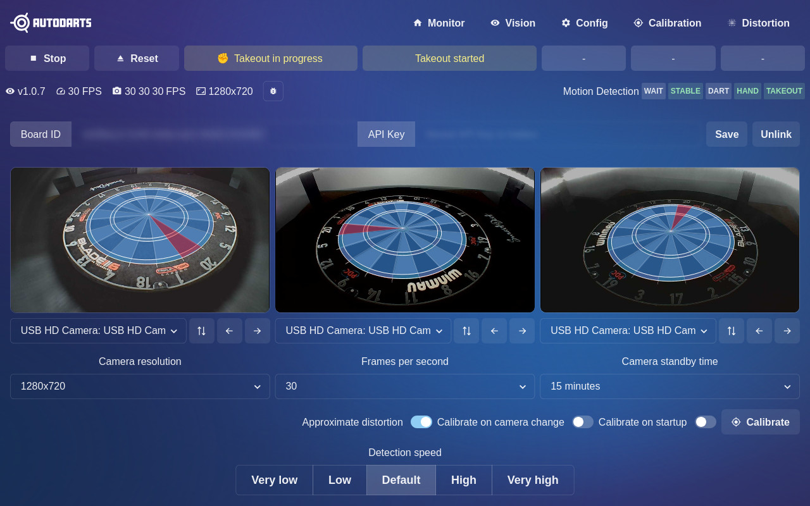
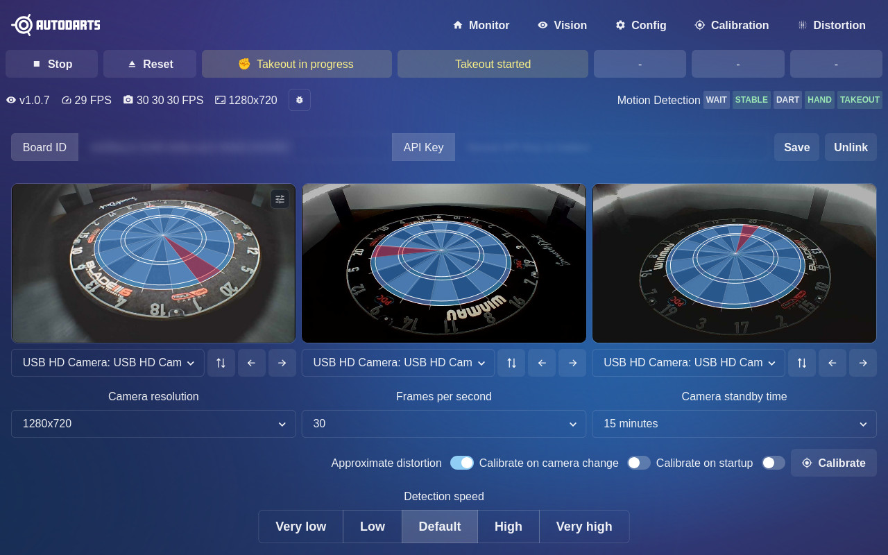
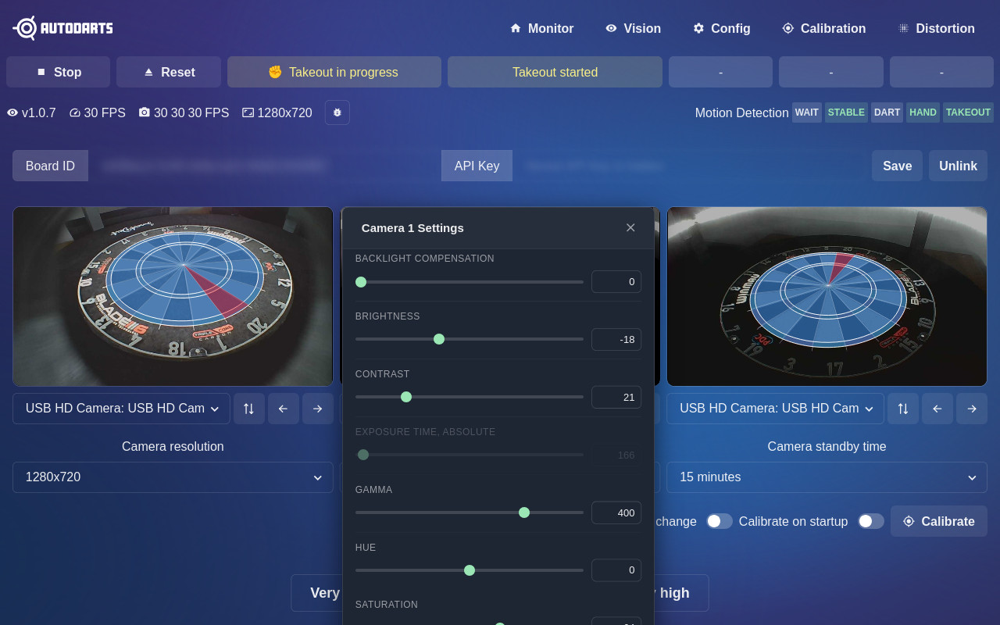
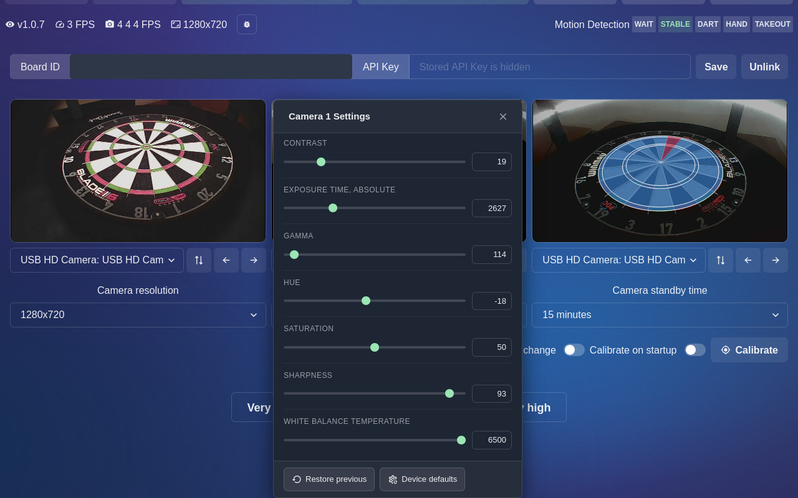

# Autodarts Camera Settings

A browser extension that adds V4L2 camera control panels to the [Autodarts](https://autodarts.io) board's `/config` page. Click any camera stream image to open a floating panel with sliders, toggles, and selects for every V4L2 control exposed by the board.

Supports **Chrome / Chromium** (Manifest V3) and **Firefox / Waterfox** (Manifest V2).

---

## Screenshots

### Config page — three camera feeds, extension active


### Hover over a camera — settings badge appears with green outline


### Click to open the V4L2 settings panel


### Sliders for brightness, contrast, gamma and more


### Footer actions: restore snapshot or reset to device defaults


---

## Features

- **Per-camera controls** — opens a panel scoped to the camera you click
- **All V4L2 control types** — integer sliders, boolean toggles, menu selects
- **Snapshot & restore** — values are captured when the panel opens; "Restore previous" replays them
- **Device defaults** — one click to reset all controls to the camera's factory defaults
- **Non-intrusive** — transparent overlay, no page dimming; only the camera image area is clickable
- **Inactive controls** rendered as disabled so the full control list is always visible

---

## Installation

### From the browser store

- Chrome Web Store — search *Autodarts Camera Settings*
- Firefox Add-ons (AMO) — search *Autodarts Camera Settings*

### Load unpacked (development / sideload)

1. Clone the repo and build:
   ```bash
   git clone https://github.com/vllni/browser-extension-autodarts-camera-settings
   cd browser-extension-autodarts-camera-settings
   npm install
   bash build.sh
   ```

2. **Chrome / Chromium**  
   Go to `chrome://extensions` → enable **Developer mode** → **Load unpacked** → select `dist/chrome/`

3. **Firefox / Waterfox**  
   Go to `about:debugging` → **This Firefox** → **Load Temporary Add-on** → select `dist/firefox/manifest.json`

---

## Usage

1. Open your Autodarts board's config page at `http://<board-ip>:<port>/config`
2. Hover over any camera stream image — a settings badge (⚙) appears in the top-right corner
3. Click the image to open the V4L2 control panel for that camera
4. Adjust controls — changes are sent to the board immediately
5. Use **Restore previous** to roll back to the values from when you opened the panel
6. Use **Device defaults** to reset all controls to the camera's factory defaults

---

## Development

```bash
npm install        # install Jest + jsdom
npm test           # run the 24-test suite
bash build.sh      # build dist/chrome/ and dist/firefox/ + zip packages
```

### Project structure

```
src/
  content.js            # content script (single IIFE)
  content.css           # injected styles (Chakra UI dark theme)
  manifest.chrome.json  # Chrome MV3 manifest
  manifest.firefox.json # Firefox MV2 manifest
  icons/                # PNG icons (generated by build.sh)
tests/
  content.test.js       # Jest + jsdom tests
build.sh                # build script
```

### CI/CD secrets

The release workflow requires five repository secrets (**Settings → Secrets and variables → Actions**).

#### Chrome Web Store

1. [console.cloud.google.com](https://console.cloud.google.com) → create a project → **APIs & Services → Enable APIs** → enable **Chrome Web Store API**
2. **APIs & Services → Credentials → Create Credentials → OAuth client ID** → type **Desktop app** → copy **Client ID** and **Client Secret**
3. Open this URL in your browser (replace `CLIENT_ID`):
   ```
   https://accounts.google.com/o/oauth2/auth?client_id=CLIENT_ID&redirect_uri=urn:ietf:wg:oauth:2.0:oob&response_type=code&scope=https://www.googleapis.com/auth/chromewebstore
   ```
4. Exchange the code for a refresh token:
   ```bash
   curl -X POST https://oauth2.googleapis.com/token \
     -d client_id=CLIENT_ID \
     -d client_secret=CLIENT_SECRET \
     -d code=AUTH_CODE \
     -d grant_type=authorization_code \
     -d redirect_uri=urn:ietf:wg:oauth:2.0:oob
   ```
   Copy `refresh_token` from the response.
5. The extension ID appears in the Chrome Web Store dashboard URL after the first manual upload.

| Secret | Where to find it |
|--------|-----------------|
| `CHROME_EXTENSION_ID` | Chrome Web Store developer dashboard |
| `CHROME_CLIENT_ID` | Google Cloud Console → OAuth client |
| `CHROME_CLIENT_SECRET` | Google Cloud Console → OAuth client |
| `CHROME_REFRESH_TOKEN` | `refresh_token` field from step 4 |

#### Firefox Add-ons (AMO)

1. Log in at [addons.mozilla.org](https://addons.mozilla.org) with the account used to submit the extension
2. Go to **https://addons.mozilla.org/en-US/developers/addon/api/key/**
3. Click **Generate new credentials**

| Secret | AMO field |
|--------|-----------|
| `FIREFOX_API_KEY` | JWT issuer |
| `FIREFOX_API_SECRET` | JWT secret |

---

### Board API

The extension talks to the Autodarts board's local REST API — The three endpoints used are:

| Method | Path | Purpose |
|--------|------|---------|
| `GET` | `/api/cams/controls/{cam}` | Fetch all controls for a camera |
| `PATCH` | `/api/cams/controls/{cam}` | Update one or more control values |
| `POST` | `/api/cams/controls/{cam}/reset` | Reset all controls to device defaults |

---

## License

[MIT](LICENSE)
